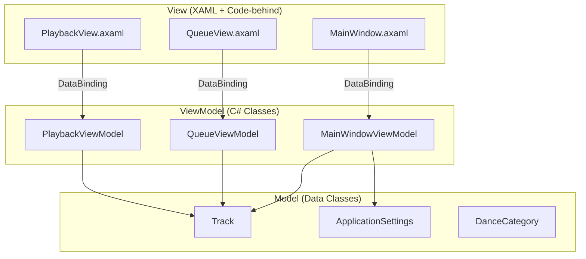
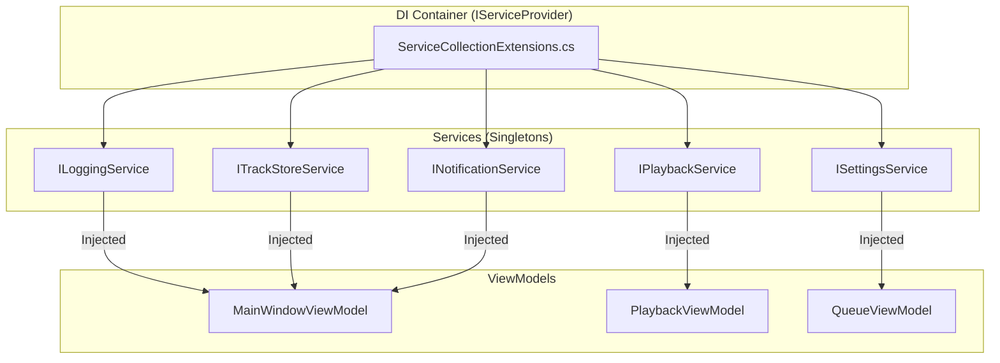
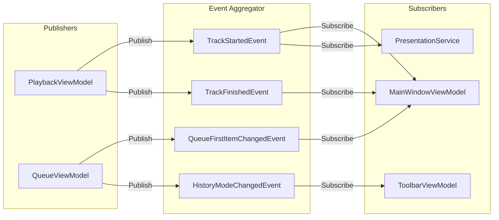
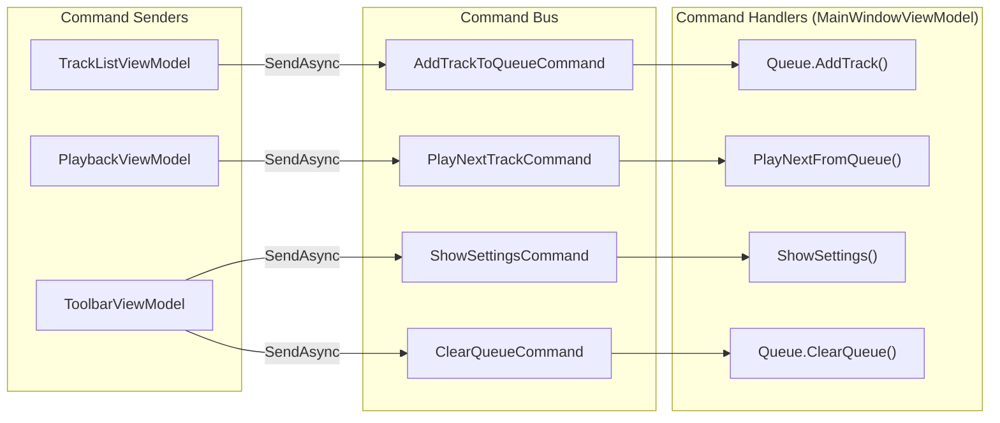
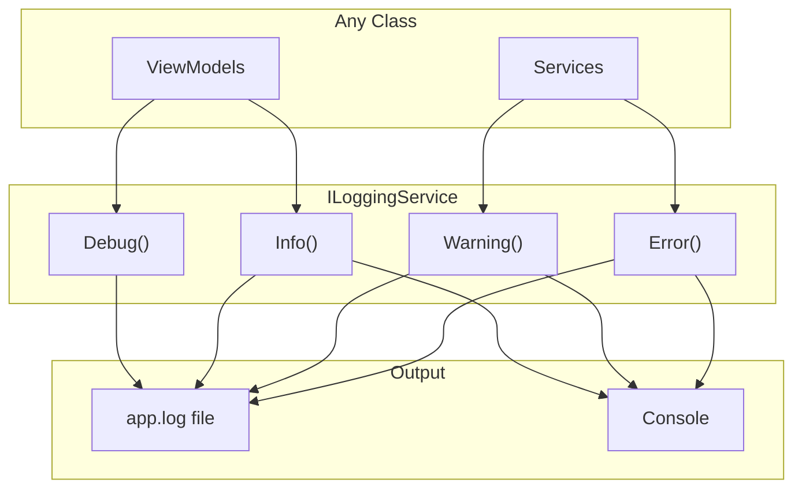
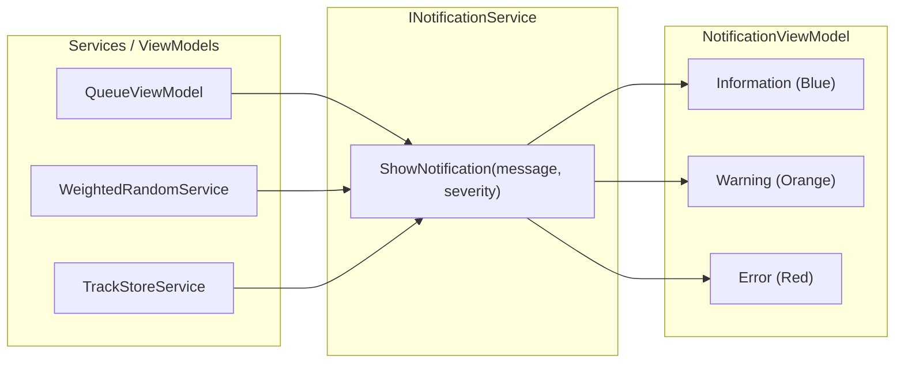

# Architecture Documentation

This document provides a developer-friendly overview of the NeoBalfolkDJ architecture. It covers the key patterns and concepts used throughout the codebase.

## Table of Contents

- [MVVM Pattern](#mvvm-pattern)
- [Dependency Injection & Services](#dependency-injection--services)
- [Event Aggregator](#event-aggregator)
- [Command Bus](#command-bus)
- [Logging](#logging)
- [Notifications](#notifications)

---

## MVVM Pattern

NeoBalfolkDJ uses the **Model-View-ViewModel (MVVM)** pattern, which separates UI concerns from business logic.

### How It Works



| Layer | Responsibility | Examples |
|-------|---------------|----------|
| **View** | UI rendering, user input | `MainWindow.axaml`, `QueueView.axaml` |
| **ViewModel** | UI logic, state management, commands | `MainWindowViewModel`, `QueueViewModel` |
| **Model** | Data structures, business entities | `Track`, `ApplicationSettings` |

### How to Add New Code

**Adding a new View:**

1. Create `Views/MyNewView.axaml` and `Views/MyNewView.axaml.cs`
2. Create `ViewModels/MyNewViewModel.cs` extending `ViewModelBase`
3. Register the ViewModel in `ServiceCollectionExtensions.cs`:
   ```csharp
   services.AddSingleton<MyNewViewModel>();
   ```
4. Set the `DataContext` in the View or use the `ViewLocator`

**Adding a new property to a ViewModel:**

```csharp
public partial class MyViewModel : ViewModelBase
{
    [ObservableProperty]  // CommunityToolkit.Mvvm generates PropertyChanged
    private string _myProperty = string.Empty;
    
    [RelayCommand]  // Generates ICommand for button binding
    private void DoSomething()
    {
        // Command logic
    }
}
```

---

## Dependency Injection & Services

All services are registered in the DI container and injected via constructors.

### How It Works



Services are registered in `ServiceCollectionExtensions.cs`:

```csharp
public static IServiceCollection AddNeoBalfolkDj(this IServiceCollection services, ILoggingService loggingService)
{
    // Infrastructure
    services.AddSingleton<IDispatcher, AvaloniaDispatcher>();
    services.AddSingleton(loggingService);
    services.AddSingleton<IEventAggregator, EventAggregator>();
    services.AddSingleton<ICommandBus, CommandBus>();

    // Services
    services.AddSingleton<ISettingsService, SettingsService>();
    services.AddSingleton<INotificationService, NotificationService>();
    services.AddSingleton<ITrackStoreService, TrackStoreService>();
    // ... more services

    // ViewModels
    services.AddSingleton<MainWindowViewModel>();
    services.AddSingleton<QueueViewModel>();
    // ... more ViewModels

    return services;
}
```

### How to Add New Code

**Adding a new service:**

1. Create the interface in `Services/IMyService.cs`:
   ```csharp
   public interface IMyService
   {
       void DoWork();
       Task<string> GetDataAsync();
   }
   ```

2. Create the implementation in `Services/MyService.cs`:
   ```csharp
   public class MyService : IMyService, IDisposable
   {
       private readonly ILoggingService _logger;
       
       public MyService(ILoggingService logger)
       {
           _logger = logger;
       }
       
       public void DoWork() { /* ... */ }
       public Task<string> GetDataAsync() { /* ... */ }
       
       public void Dispose() { /* cleanup */ }
   }
   ```

3. Register in `ServiceCollectionExtensions.cs`:
   ```csharp
   services.AddSingleton<IMyService, MyService>();
   ```

4. Inject into ViewModels or other services:
   ```csharp
   public MyViewModel(IMyService myService)
   {
       _myService = myService;
   }
   ```

---

## Event Aggregator

The Event Aggregator enables **decoupled communication** between ViewModels. Publishers don't know about subscribers.

### How It Works



### Event Aggregator vs Traditional C# Events

| Aspect | Event Aggregator | Traditional `+=` Events |
|--------|-----------------|------------------------|
| **Coupling** | Loose - no direct reference | Tight - publisher knows subscriber type |
| **Scope** | Application-wide broadcast | Between two known objects |
| **Use case** | Cross-cutting, multiple subscribers | Parent-child, View-ViewModel, 1-to-1 |
| **Memory** | Returns `IDisposable` | Must manually unsubscribe (`-=`) |
| **Threading** | Can marshal to UI thread | Caller's thread |

**Use Event Aggregator when:**
- Multiple unrelated ViewModels need to react to the same event
- Publisher shouldn't know about subscribers
- Event represents a "fact" that happened (past tense naming)

**Use traditional `+=` events when:**
- View needs to show a dialog (file picker, confirmation)
- Direct parent-child relationship
- High-frequency events (e.g., `PropertyChanged`, `CollectionChanged`)
- Type-safe parameters (settings changes with specific types)
- Service-to-ViewModel notifications (1-to-1 relationship)

### How to Add New Code

**Creating a new event:**

1. Create the event record in `Messaging/Events/`:
   ```csharp
   // Messaging/Events/MyNewEvent.cs
   namespace NeoBalfolkDJ.Messaging.Events;
   
   /// <summary>
   /// Event raised when something important happened.
   /// </summary>
   public sealed record MyNewEvent(string Data, int Count);
   ```

2. Publish from a ViewModel:
   ```csharp
   _eventAggregator.Publish(new MyNewEvent("hello", 42));
   ```

3. Subscribe in another ViewModel (store the subscription for disposal):
   ```csharp
   // In constructor or initialization
   _subscriptions.Add(_eventAggregator.Subscribe<MyNewEvent>(evt =>
   {
       // Handle the event
       Console.WriteLine($"Received: {evt.Data}, {evt.Count}");
   }));
   
   // In Dispose()
   foreach (var sub in _subscriptions) sub.Dispose();
   ```

---

## Command Bus

The Command Bus handles **action requests** between ViewModels. Commands are imperative ("do this").

### How It Works



### Commands vs Events

| Aspect | Commands | Events |
|--------|----------|--------|
| **Naming** | Imperative verb (`AddTrackToQueueCommand`) | Past tense (`TrackAddedToQueueEvent`) |
| **Intent** | Request an action | Report something happened |
| **Handlers** | Usually one | Can be many |
| **Direction** | ViewModel → Orchestrator | Publisher → Many subscribers |

### How to Add New Code

**Creating a new command:**

1. Create the command record in `Messaging/Commands/`:
   ```csharp
   // Messaging/Commands/MyNewCommand.cs
   namespace NeoBalfolkDJ.Messaging.Commands;
   
   /// <summary>
   /// Command to do something specific.
   /// </summary>
   public sealed record MyNewCommand(string Parameter);
   ```

2. Register handler in `MainWindowViewModel.RegisterCommandHandlers()`:
   ```csharp
   _subscriptions.Add(_commandBus.RegisterHandler<MyNewCommand>(cmd =>
   {
       // Handle the command
       DoSomething(cmd.Parameter);
       return Task.CompletedTask;
   }));
   ```

3. Send from any ViewModel:
   ```csharp
   _commandBus.SendAsync(new MyNewCommand("value"));
   ```

---

## Logging

Centralized logging via `ILoggingService` with file output and log rotation.

### How It Works



### Log Levels

| Level | Use Case | Example |
|-------|----------|---------|
| `Debug` | Detailed diagnostic info | `"Track dequeued: Artist - Title"` |
| `Info` | Normal operations | `"Application started"` |
| `Warning` | Potential issues | `"Failed to preload track"` |
| `Error` | Errors with exception | `"Playback failed"`, includes stack trace |
| `Critical` | Fatal errors, application cannot continue | `"Failed to initialize audio system"` |

### How to Add New Code

**Using the logging service:**

```csharp
public class MyService
{
    private readonly ILoggingService _logger;
    
    public MyService(ILoggingService logger)
    {
        _logger = logger;
    }
    
    public void DoWork()
    {
        _logger.Debug("Starting work...");
        
        try
        {
            // ... work
            _logger.Info("Work completed successfully");
        }
        catch (Exception ex)
        {
            _logger.Error("Work failed", ex);
        }
    }
}
```

**Log file location:** `~/.config/NeoBalfolkDJ/app.log` (Linux) or `%APPDATA%\NeoBalfolkDJ\app.log` (Windows)

---

## Notifications

User-facing notifications displayed in the UI via `INotificationService`.

### How It Works



### Notification Severities

| Severity | Color | Use Case |
|----------|-------|----------|
| `Information` | Blue | Success messages, confirmations |
| `Warning` | Orange | Non-critical issues, user should be aware |
| `Error` | Red | Failures, something went wrong |

### How to Add New Code

**Showing a notification:**

```csharp
public class MyViewModel
{
    private readonly INotificationService _notifications;
    
    public MyViewModel(INotificationService notifications)
    {
        _notifications = notifications;
    }
    
    public void DoSomething()
    {
        if (success)
        {
            _notifications.ShowNotification("Operation completed!", NotificationSeverity.Information);
        }
        else
        {
            _notifications.ShowNotification("Something went wrong", NotificationSeverity.Error);
        }
    }
}
```

**In QueueViewModel (common pattern):**

```csharp
if (QueuedItems.Count >= MaxQueueItems)
{
    NotificationService?.ShowNotification(
        $"Queue is full (max {MaxQueueItems} items)", 
        NotificationSeverity.Warning);
    return;
}
```

---

## Summary: When to Use What

| Scenario | Pattern |
|----------|---------|
| ViewModel A triggers action in ViewModel B | **Command Bus** |
| Something happened, multiple places care | **Event Aggregator** |
| View needs to show dialog/picker | **Traditional `+=` event** |
| Setting value changed (type-safe) | **Traditional `+=` event** |
| Service notifies ViewModel | **Traditional `+=` event** |
| Need reusable business logic | **Service (DI)** |
| User needs feedback | **INotificationService** |
| Developer needs debugging info | **ILoggingService** |


